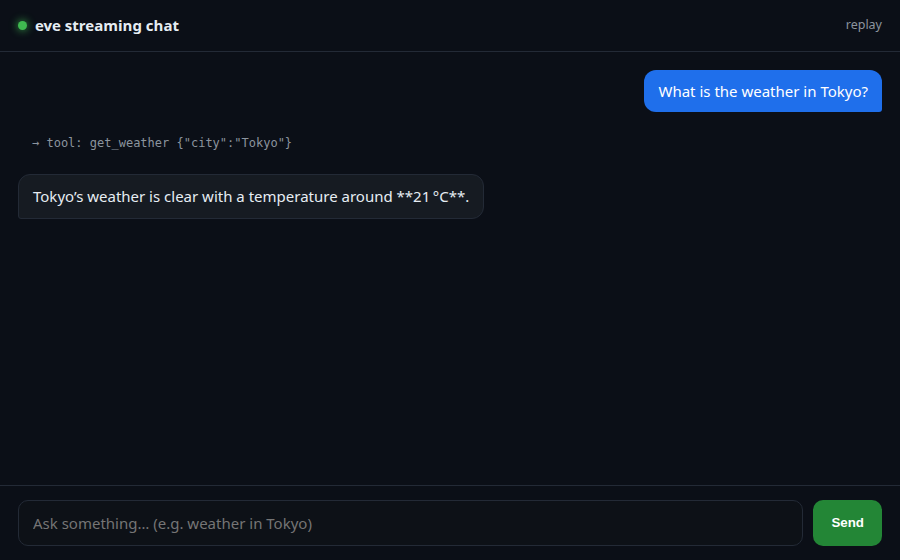

# 19 · Streaming-Chat Agent + Minimal Web UI

**Rationale.** A browser chat UI that renders eve's NDJSON stream token-by-token, including live
tool-call indicators. The UI (`web/index.html`) is plain HTML/JS; a tiny same-origin proxy
(`web/serve.mjs`) serves it and forwards `/eve/*` to the eve dev server (so the browser and API
share an origin — no CORS).

**Stack.** OpenRouter `openai/gpt-oss-120b` · eve HTTP/NDJSON channel · static UI + proxy.

## Run
```bash
cd archetypes/19-web-ui
npx eve dev --no-ui --port 3131 &           # the agent
node web/serve.mjs 8080 http://127.0.0.1:3131   # UI + proxy
# open http://127.0.0.1:8080  (or ?q=...  to auto-send, ?session=<id> to replay)
```

## Proof (`web/screenshot.png`)
Real headless-Chrome screenshot of a completed turn: the user asks "What is the weather in Tokyo?",
the UI shows the `get_weather {"city":"Tokyo"}` tool call, then the streamed reply
*"Tokyo's weather is clear with a temperature around 21 °C."*



The same flow was verified at the protocol level through the proxy: 15 live `message.appended`
deltas + `get_weather` + `message.completed` (the events the page renders).

## Cost notes
~few k tokens, no sandbox. ≈ $0.0005.
